### GAN in Pytorch

Pytorch implementations of Generative Adversarial Network algorithms. 

* GAN
* WGAN
* WGAN-GP
* DCGAN
* CGAN
* Context-Encoder
* Pix2Pix
* CycleGAN
* StarGAN
* Unit
* MUnit
* SRGAN
* ESRGAN

&emsp;

#### GAN

Note that we choose the -log(D(G(x))) to update the generator, and the generation effect are as follows.

|             Example1             |             Example2             |
| :------------------------------: | :------------------------------: |
| 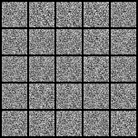 | 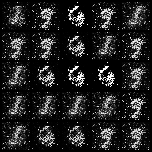 |

##### Run Example

```bash
$ cd gan
$ python train.py
$ python infer.py
```

&emsp;

#### WGAN

Compared with GAN, WGAN has the following modification

* the sigmoid function employed in last layer is removed.
* the loss function of generator and discriminator don't need the log operation.
* clipping the absolute value of  parameters of the discriminator to a constant c after updating the discriminator.
* When choosing optimizer, note that RMSProp, SGD can be better.

|             Epoch(1-100)             |             Epoch(101-200)             |
| :------------------------------: | :------------------------------: |
| 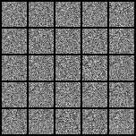 |  |

##### Run Example

```bash
$ cd wgan
$ python train.py
$ python infer.py
```

&emsp;

#### WGAN-GP

Compared with WGAN, WGAN-GP has the following modification
* Modify the object function and add the second gradient penalty
* Batch Normalization can't be used in the discriminator
* When choosing optimizer, note that Adam can be better.

|             Epoch(1-100)             |             Epoch(101-200)             |
| :------------------------------: | :------------------------------: |
| 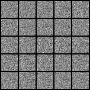 | 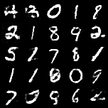 |

##### Run Example

```bash
$ cd wgan-gp
$ python train.py
$ python infer.py
```

&emsp;

#### DCGAN
Compared with GAN, DCGAN has the following modifications
* Replace the pooling layer with convolution or deconvolution.
* Insert the batch normalization to the generator and discriminator.
* Replace the fc layer with global pooling layer
* The output layer of generator uses the Tanh function, the others Relu
* All the layers of discriminator use the LeakyRelu function
* Note that DCGAN needs more training time

|             Epoch(1-100)             |             Epoch(101-200)             |
| :------------------------------: | :------------------------------: |
| 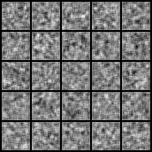 | 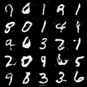 |

##### Run Example

```bash
$ cd dcgan
$ python train.py
$ python infer.py
```

&emsp;

#### CGAN
Compared with GAN, CGAN embeds label into the images in two places
* the input of generator, so the input form is [z, label]
* the input of discriminator, so the input form is [imgs, label]
* the total model is trained in the from of lsgan
  * the last layer of discriminator is linear
  * cross entropy is replaced with the mean squared error
* There is an confusing problem that during the infer phase
  * Good results can be obtain under the condition range from 0 to 9 while [1, 1, ..., 1] will get bad results.
  * Random digit condition can also obtain good results
  * It's considered that the input digit category of generator are always random digit categories, which makes the generator behave worse in the same digit category.

|             Epoch(1-100)             |             Epoch(101-200)             |
| :------------------------------: | :------------------------------: |
| |  |

##### Run Example

```bash
$ cd cgan
$ python train.py
$ python infer.py
```

#### Context-Encoder
Context-Encoder aims at taking an image with missing part as input, and then predicting the missing part.
* The total model is trained in the form of lsgan
* For discriminator, PatchGAN is employed
* For simplicity's sake, the input image size is 128 and the mask size is 64
* In infer.py, display_network() can be used to print the network architecture

|             Epoch(1-100)             |             Epoch(101-200)             |             Dragon Ball             |
| :------------------------------: | :------------------------------: | :------------------------------: |
| 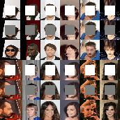| 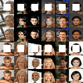 | 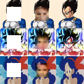 |

##### Run Example

```bash
$ cd context-encoder
$ python train.py
$ python infer.py
```

&emsp;

#### Pix2Pix
Pix2Pix aims at converting an input image into a corresponding output image, such as the conversion between grayscale image, gradient image and color image.
* The total model is trained in the form of lsgan
* For discriminator, PatchGAN is emloyed
* Generator is designed in the form of UNet
* In infer.py, display_network() can be used to print the network architecture

|             Training             |             Inferring             | 
| :------------------------------: | :------------------------------: |
| 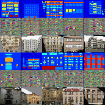|  |


|             Training             |             Inferring             | 
| :------------------------------: | :------------------------------: |
| 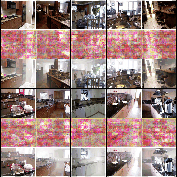| 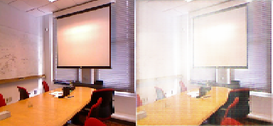 |

```bash
$ cd pix2pix
$ python train.py
$ python infer.py
```

&emsp;

#### CycleGAN
To be continued~